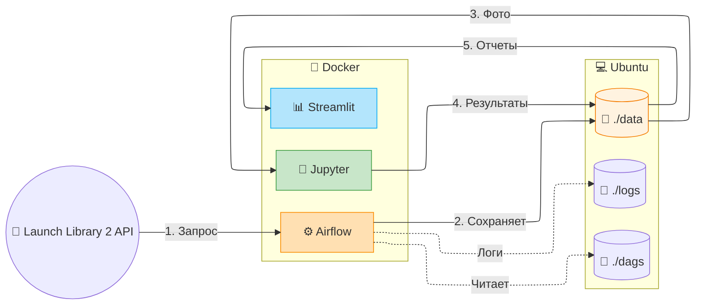
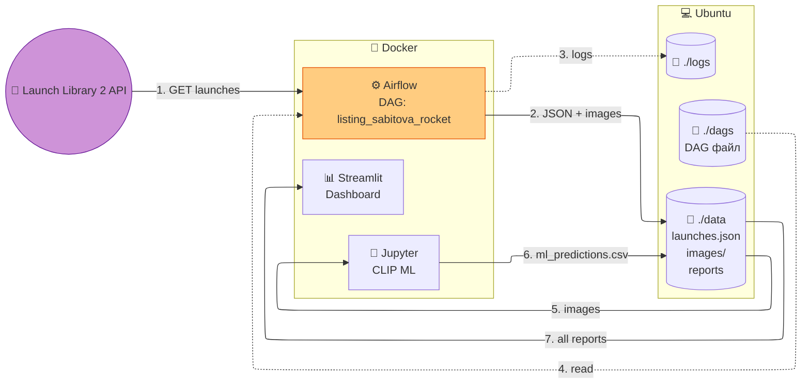

# Лабораторная работа работа 5.2 Разработка алгоритмов для трансформации данных. Airflow DAG

# Цель работы

1. Закрепить навыки развертывания Apache Airflow в контейнеризированной среде (Docker).
2. Изучить работу с JSON-данными и бинарным контентом (изображениями) внутри ETL-процесса.
3. Научиться проектировать архитектуру ETL-решений и визуализировать её.
4. Автоматизировать выгрузку результатов работы DAG из контейнера в хост-систему.

# Архитектура решения

# Архитектура аналитического решения

## 1. Верхнеуровневая архитектура

    style Jupyter fill:#a5d6a7,stroke:#2e7d32
    style Streamlit fill:#81d4fa,stroke:#01579b
    style Data fill:#ffe0b2,stroke:#f57c00
    style Dags fill:#ffcdd2,stroke:#c62828
    style Logs fill:#ffcdd2,stroke:#c62828
