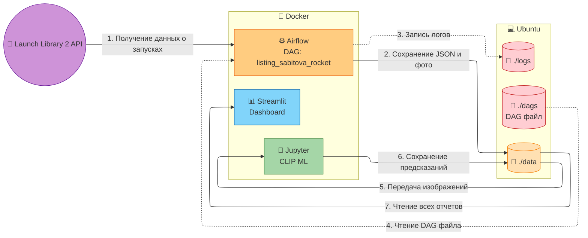
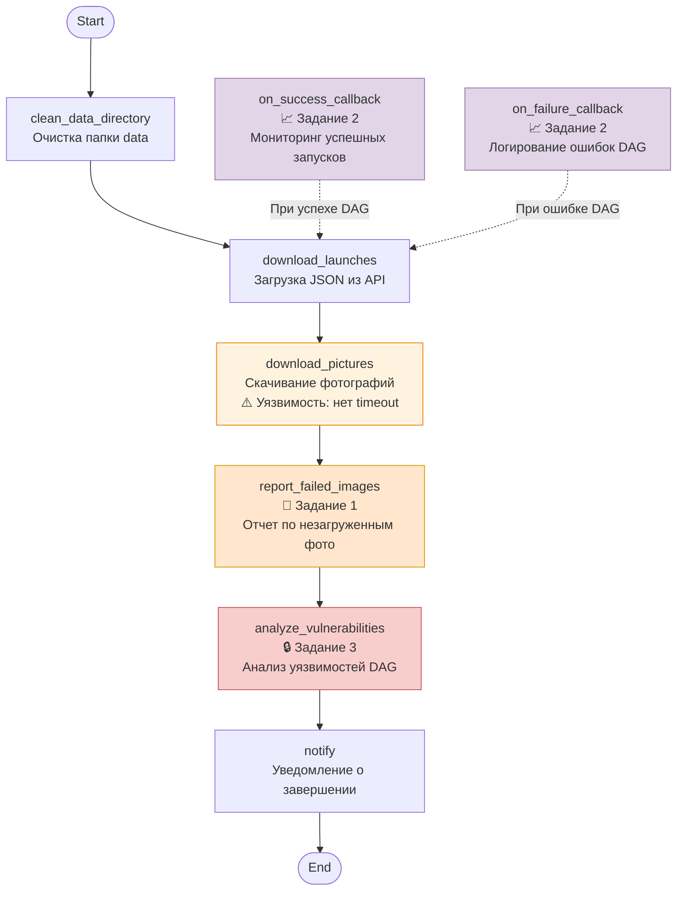

# Лабораторная работа работа 5.2 Разработка алгоритмов для трансформации данных. Airflow DAG

# Цель работы

1. Закрепить навыки развертывания Apache Airflow в контейнеризированной среде (Docker).
2. Изучить работу с JSON-данными и бинарным контентом (изображениями) внутри ETL-процесса.
3. Научиться проектировать архитектуру ETL-решений и визуализировать её.
4. Автоматизировать выгрузку результатов работы DAG из контейнера в хост-систему.

# Архитектура решения

# Логика работы DAG

