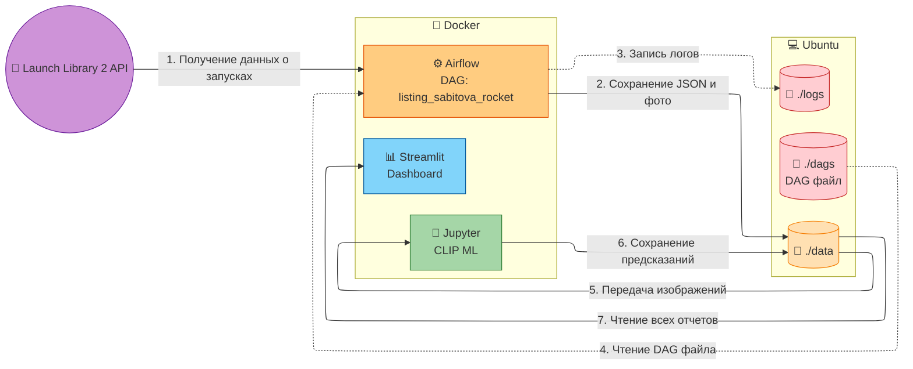
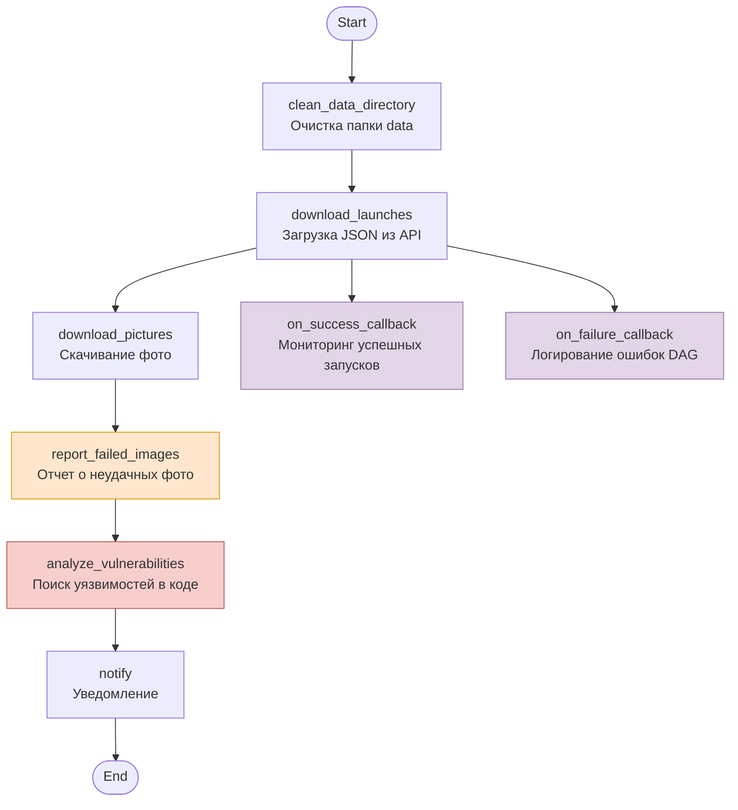

# Лабораторная работа работа 5.2 Разработка алгоритмов для трансформации данных. Airflow DAG

# Цель работы

1. Закрепить навыки развертывания Apache Airflow в контейнеризированной среде (Docker).
2. Изучить работу с JSON-данными и бинарным контентом (изображениями) внутри ETL-процесса.
3. Научиться проектировать архитектуру ETL-решений и визуализировать её.
4. Автоматизировать выгрузку результатов работы DAG из контейнера в хост-систему.

# Архитектура решения

# Пояснение к архитектуре

Архитектура построена по принципу микросервисов с общим разделяемым хранилищем (Shared Volumes). Это позволяет сервисам обмениваться файлами без сложной сетевой пересылки.

## Внешние источники и Пользователь
- **Launch Library 2 API** — внешний REST API, откуда Airflow получает данные о запусках и ссылки на фото.
- **Пользователь** — взаимодействует с системой через браузер (порты 8080, 8888, 8501).

## Хост-система и локальные папки (Bind Mounts)
На Ubuntu проброшены папки:
- `./dags` — код DAG (`listing_sabitova_rocket.py`)
- `./data` — озеро данных (JSON, фото, отчеты)
- `./logs` — логи Airflow

## Apache Airflow (ETL контур)
- **Scheduler** — запускает DAG, загружает данные из API, скачивает фото.
- **Webserver** — UI для управления и мониторинга.
- **PostgreSQL** — хранит метаданные Airflow.

## Jupyter (ML контур)
- Запускает CLIP нейросеть для классификации фото ракет.
- Сохраняет предсказания в `ml_predictions.csv`.

## Streamlit (Аналитический контур)
- Визуализирует отчеты:
  - **Задание 1** — `failed_images_report.json`
  - **Задание 2** — `launch_monitoring_*.json`, `dag_failure_*.json`
  - **Задание 3** — `vulnerability_analysis_*.json`
- Отображает галерею фото с тегами и графики.

# Технический стек

- **Оркестрация**: Apache Airflow 2.8.1
- **Контейнеризация**: Docker, Docker Compose
- **Язык программирования**: Python 3.11
- **Библиотеки (ETL & ML)**: Pandas, Scikit-learn, Joblib, Requests, Torch, Transformers, Pillow
- **Визуализация**: Streamlit, Plotly, Matplotlib
- **База данных**: PostgreSQL 12 (для метаданных Airflow)
- **Источник данных**: Launch Library 2 API

# Логика работы DAG

# Описание DAG

| Функция | Описание |
|---------|----------|
| `clean_data_directory` | Очистка папки `/data` перед новым запуском |
| `download_launches` | Получение данных о запусках из Launch Library 2 API, сохранение в `launches.json` |
| `download_pictures` | Парсинг JSON, скачивание фотографий ракет из API, сохранение в `images/` |
| `report_failed_images` | Формирование отчета о неудачных загрузках изображений, сохранение в `failed_images_report.json` |
| `analyze_vulnerabilities` | Анализ кода DAG на наличие уязвимостей (хардкод секретов, отсутствие timeout, bare except), сохранение в `vulnerability_analysis_*.json` |
| `notify` | Вывод сообщения об успешном завершении DAG |
| `on_success_callback` | Колбэк при успешном выполнении DAG: анализ статусов запусков, сохранение в `launch_monitoring_*.json` |
| `on_failure_callback` | Колбэк при ошибке DAG: логирование ошибки, сохранение в `dag_failure_*.json` |
